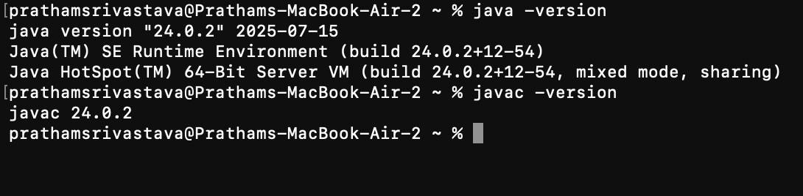

## Campus Course & Records Manager (CCRM)

# Overview
The Campus Course & Records Manager (CCRM) is a comprehensive, command-line based Java application designed to manage student and course records for an educational institution. It provides a simple, menu-driven interface for administrators to perform essential academic tasks such as student registration, course creation, student enrollment, grading, and data management.

This document serves as a guide to the project and also provides foundational knowledge about the Java ecosystem, including its history, architecture, and development environment setup.

## Table of Contents

# Project Features

Getting Started with the Project

Java Platform Fundamentals

## A Brief History of Java

Java Editions: ME vs SE vs EE  

The Java Architecture: JDK, JRE, and JVM

Setting Up Your Development Environment

Installing Java on Windows

Using the Eclipse IDE

## Project Features
# Student Management:
Add new students with unique registration numbers and list all registered students.

# Course Management: 
Create new courses, specifying details like course code, title, credits, instructor, and semester.

# Enrollment System: 
Enroll students into courses, with built-in validation to prevent duplicate enrollments and to enforce a maximum credit limit (20 credits per student).

# Grading & Transcripts: 
Record marks for a student in a specific course, which automatically calculates the corresponding letter grade. Generate a full academic transcript for any student, including their GPA.

# Data Persistence & Backup: 
Export data to CSV files for persistence and create timestamped backups for data safety.

## Getting Started with the Project
Prerequisites
Java Development Kit (JDK) 11 or higher.

Eclipse IDE for Enterprise Java and Web Developers (or any other Java IDE).

How to Compile and Run
Clone the Repository:

git clone [https://github.com/JunoJupyter-design/student-course-management-system.git](https://github.com/JunoJupyter-design/student-course-management-system.git)

Import into Eclipse:

Go to File > Import....

Select General > Existing Projects into Workspace.

Browse to the cloned repository folder.

Click Finish.

Run the Application:

Locate the Main.java file in the src/edu/ccrm/cli package.

Right-click the file and select Run As > Java Application.

Java Platform Fundamentals
A Brief History of Java
Java's journey from a project for interactive television to a globally dominant programming language is marked by continuous innovation.

1991: The "Green Team" at Sun Microsystems, led by James Gosling, begins work on the "Oak" language, initially intended for consumer electronics.

1995: Sun Microsystems formally releases Oak as Java 1.0, re-marketing it for the burgeoning World Wide Web with the slogan "Write Once, Run Anywhere."

1998: Java 2 (J2SE 1.2) is released, a major upgrade that introduces the Swing graphical toolkit and the Collections framework. The platform is split into J2SE, J2EE, and J2ME.

2004: J2SE 5.0 is released, bringing significant language features like Generics, Annotations, and Autoboxing, which greatly improve code safety and readability.

2010: Oracle Corporation acquires Sun Microsystems, taking stewardship of the Java platform.

2014: Java SE 8 is released. This is a landmark version that introduces Lambda Expressions, the Stream API, and a new Date and Time API, revolutionizing how developers write concurrent and data-processing code.

2018: Oracle introduces a new six-month release cadence, starting with Java 10. Long-Term Support (LTS) versions are designated for enterprise stability.

2021: Java 17 (LTS) is released, bringing further enhancements like Sealed Classes and Pattern Matching for instanceof.

Java Editions: ME vs SE vs EE
Java is not a monolithic platform; it is divided into different editions tailored for specific types of applications.

Feature

Java ME (Micro Edition)

Java SE (Standard Edition)

Java EE (Enterprise Edition)

Primary Use

Java ME- Mobile devices, embedded systems, and IoT devices.

Java SE- Desktop applications, servers, and console apps.

Java EE- Large-scale, distributed, and web-based applications.

Core API

Java ME- A small subset of the Java SE API.

Java SE- The core Java programming language and libraries.

Java EE- Extends Java SE with APIs for enterprise features.

Key Features

Java ME- Limited resources, small memory footprint, low power.

Java SE- Rich APIs for GUIs, networking, database access.

Java EE- Web services (JAX-WS), Servlets, messaging (JMS).

Example App

Java ME- A simple game on an old feature phone.

Java SE- This Campus Course & Records Manager project.

Java EE- A large online banking or e-commerce website.

The Java Architecture: JDK, JRE, and JVM
The Java platform is built on three core components that work together to compile and run a Java application.

JVM (Java Virtual Machine)

What it is: An abstract computing machine that enables a computer to run a Java program. The JVM is platform-dependent, meaning there are different JVM implementations for Windows, macOS, and Linux.

Role: It reads the compiled Java bytecode (the .class files) and interprets or compiles it into native machine code for the underlying operating system. This is the component that makes Java "platform-independent."

JRE (Java Runtime Environment)

What it is: A software package that provides the necessary libraries and the JVM to run Java applications. It is the minimum requirement to execute a Java program on a machine.

Role: It combines the JVM with the core Java libraries (like java.lang, java.util, etc.) that your program's code needs to function. The JRE does not contain tools for development like compilers or debuggers.

JDK (Java Development Kit)

What it is: A full-featured software development kit for creating Java applications. It includes everything the JRE has, plus development tools.

Role: The JDK provides the complete environment for developers. It contains the JRE to run the code, a compiler (javac) to turn .java source files into .class bytecode, a debugger (jdb), and other tools. You need the JDK to write and compile Java code.

Interaction Summary: A developer writes .java code and uses the JDK to compile it into bytecode. This bytecode can then be distributed to any user who has the JRE installed. The JRE's JVM then executes that bytecode on the user's specific operating system.

Setting Up Your Development Environment
Installing Java on Windows
Download the JDK: Go to the official Oracle Java Downloads page. Select the latest LTS version (e.g., JDK 17) and download the "x64 Installer" for Windows.

Run the Installer: Execute the downloaded .msi file and follow the on-screen instructions. The JDK will typically be installed in C:\Program Files\Java\jdk-17.x.x.

Configure Environment Variables:

Search for "Edit the system environment variables" in the Windows Start Menu and open it.

Click the "Environment Variables..." button.

Under "System variables," click "New..." to create a new variable:

Variable name: JAVA_HOME

Variable value: C:\Program Files\Java\jdk-17.0.5 (or your specific JDK installation path)

Find the Path variable in the "System variables" list, select it, and click "Edit...".

Click "New" and add a new entry: %JAVA_HOME%\bin

Click OK on all windows to save the changes.

Verify the Installation: Open a new Command Prompt and run the following commands. They should display the installed versions.

java -version
javac -version

Using the Eclipse IDE
Creating a New Java Project
Launch Eclipse IDE.

Go to File > New > Java Project.

Enter a Project name (e.g., MyFirstJavaProject).

Ensure the correct JRE is selected.

Click Finish. The project will appear in the Package Explorer.

Creating and Running a Program
Right-click the src folder in your new project and select New > Class.

Give the class a name (e.g., HelloWorld) and check the box for public static void main(String[] args).

Add some code to the main method, for example: System.out.println("Hello, World!");

Create a Run Configuration:

Right-click the HelloWorld.java file in the Package Explorer.

Select Run As > Run Configurations....

In the "Java Application" section, a new configuration for your HelloWorld class should already exist. You can inspect the settings here.

Click Run. The output will appear in the Console view.